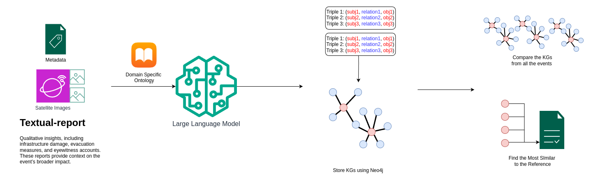

# 🌍 LLM-Driven Knowledge Graphs for Extreme Events

This repository accompanies our paper:  
**"LLM-Driven Knowledge Graph Construction from Earth Observation Data for Extreme Events"**  
(presented at the DARES 2025 Workshop, ECAI 2025, Barcelona).

---

## 📝 Abstract

The increasing frequency and severity of climate-related disasters call for more interpretable and actionable insights from Earth Observation (EO) data. In this work, we propose a novel framework that leverages multimodal Large Language Models (LLMs) to construct structured Knowledge Graphs (KGs) from heterogeneous disaster-related sources, including satellite imagery, textual reports, and geospatial metadata. By grounding these data streams in a domain-specific ontology, we produce semantically rich, human-aligned representations of extreme events, enabling transparent reasoning and flexible querying across spatial, temporal, and socio-economic dimensions. We demonstrate the utility of our system through a detailed case study on flood events, supported by quantitative evaluations of the extracted triples and example KG-based queries. Our results show that this approach enables interpretable comparisons of disaster events, supports informed planning, and provides a reusable interface for downstream analysis in climate resilience and emergency response.

**Keywords:** Multimodal LLMs, KGs, Earth Observation, Satellite Imagery, Extreme Weather, Flood Events, Disaster Forecasting, Interpretability, Ontology-Guided Extraction, Semantic Querying

---

## 📈 System Architecture

The diagram below shows the end-to-end pipeline that transforms multimodal disaster data into structured Knowledge Graphs. It combines text and satellite imagery, uses an ontology for semantic alignment, and employs LLMs with retrieval-augmented generation to extract high-quality triples for robust event analysis.

  

---

## 🗂️ Project Structure

| Folder | Description |
|--------|-------------|
| `data/` | Input files including filtered flood metadata and satellite image directories. |
| `scripts/` | Python scripts for extracting triples, computing embeddings, and generating explanations using LLMs. |
| `triples/from_images/` | Triples extracted from satellite imagery (NDWI, NIR, Visual). |
| `triples/from_text_modality/` | Triples extracted from textual flood descriptions. |
| `neo4j/` | Cypher query examples (`queries.txt`) and Neo4j integration logic. |
| `assets/` | Pipeline diagram and images for documentation or dashboards. |
| `requirements.txt` | Dependencies for running the triple extraction, embedding, and KG insertion pipelines. |

---