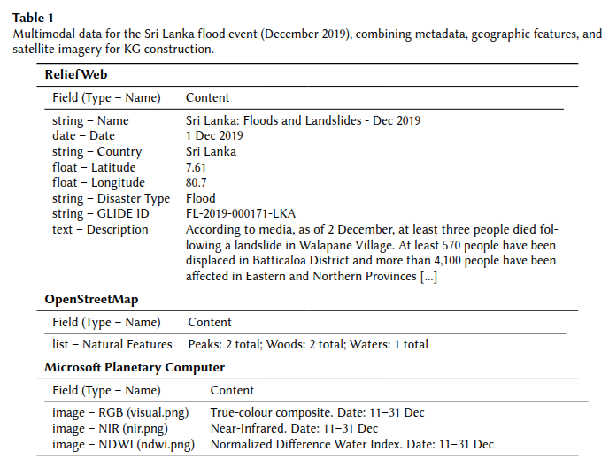

# 📁 triples/

This folder stores all extracted triples for knowledge graph construction.

- `triples_from_text/` – Triples extracted from textual descriptions (e.g., ReliefWeb reports).
- `triples_from_images/` – Triples extracted from satellite imagery using multimodal LLMs.

---

## 🧪 Example Input for a Single Event

Below is an example of multimodal input data used to extract structured triples for a flood event in **Sri Lanka (Dec 2019)**:

  

---

## 🖼️ Satellite Image Types

For each event, the system retrieves and processes three types of satellite images (if existing):

| RGB (Visual) | NIR | NDWI |
|--------------|-----|------|
|  |

These images are then passed to different prompt-based extraction scripts to derive semantic triples describing environmental conditions and flood impacts.
