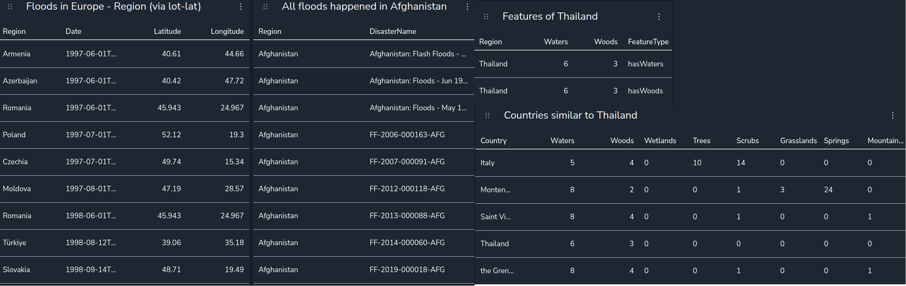

# 📁 neo4j/

This folder includes all necessary files for loading and querying the knowledge graph in Neo4j.

---

## 🔧 Files Overview

| File | Description |
|------|-------------|
| `queries.txt` | Example Cypher queries used in the paper to explore the KG (e.g. top disasters by fatalities, spatial filters, environmental similarity, etc.). |
| `insert_everything.py` | Loads triples from both text and image sources into the Neo4j graph database. It handles predicate types, subject-object mapping, and entity merging. |

---

## 🧩 What Happens After Triple Insertion?

Running `insert_everything.py` populates the Neo4j database with structured data extracted from flood event descriptions and satellite images. Once inserted, the KG will look something like this:

<p align="center">
  
</p>

- **Left:** A single disaster event (purple) with its country (green), images (blue), and extracted attributes (orange).
- **Right:** The full knowledge graph with hundreds of events and their connected semantic information.

---

## 🔎 Explore the Graph with Neo4j Browser or Neodash

You can explore the graph database via:

- 🖥 **Neo4j Browser**: http://localhost:7474  
- 📊 **Neodash Dashboard**: http://localhost:5005

### 🚀 To run Neodash:
```bash
sudo docker run -p 5005:5005 -d neo4jlabs/neodash
```
---

## 📋 Example Query Outputs

These are representative visualisations from the dashboard using Cypher queries defined in `queries.txt`.

---

### 🌍 Geospatial and Environmental Queries

This panel includes:

- **Floods in Europe** (via lat/lon filtering)
- **All floods in Afghanistan**
- **Environmental features of Thailand**
- **Countries similar to Thailand** (based on waters, woods, wetlands, etc.)

<p align="center">
  
</p>

---

### 📊 Top-K Disaster Impact Queries

This panel shows ranked outputs by:

- Number of **people affected**
- Reported **fatalities**
- **Businesses damaged**
- **Agricultural land affected**

<p align="center">
  
</p>

---

### 🧠 Image-Based Event Similarity via Triples

Here we compare disasters based on triples extracted from their associated images:

- **Visual (RGB):** E.g., land cover, erosion, dry terrain  
- **NDWI:** Flood extent, surface saturation  
- **NIR:** Vegetation health and signs of water stress

<p align="center">
  
</p>

This enables interpretable, structured image-based comparisons across disaster events.

